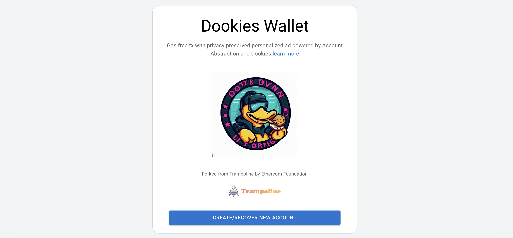
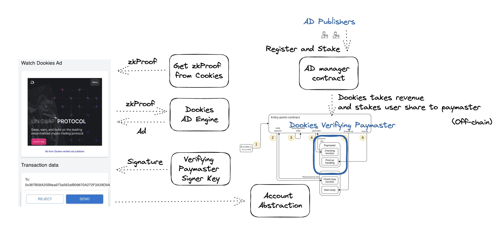

## Dookies - Account Abstraction

## How It Works

1. Dookie's Wallet obtains a zero-knowledge proof from cookies.
2. Receive personalized ads from the Ad Engine using the zero-knowledge proof.
3. Obtain the Paymaster's verification signature after viewing the ad.
4. The transaction is sponsored by Dookie's Paymaster.
5. The Paymaster's revenue is managed through the Dookie Ad system.

## How It Was Built

The development of the Dookie's Wallet began with the Trampoline Wallet as our foundation.

The primary modifications we made revolved around the 'Create User Operation' process, which we restructured to include verification through Dookie's Paymaster.

### Call create custome userOp with Dookies

https://github.com/D00ki3s/account-abstraction/blob/main/wallet/src/pages/Popup/pages/sign-transaction-request/sign-transaction-request.tsx#L52

### Creating custome userOp with Dookies

https://github.com/D00ki3s/account-abstraction/blob/main/wallet/src/pages/Background/redux-slices/transactions.ts#L174

### Contracts

We are currently using Simple Account and verifying the Paymaster from [Infinitism Account Abstraction contract package](https://github.com/eth-infinitism/account-abstraction)
